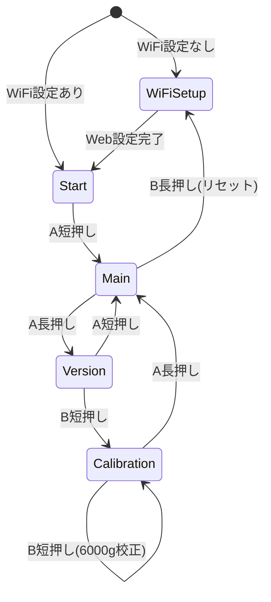

# 画面遷移



# M5StickC Plus2 ボタン位置

- 本READMEでは、画面を正面に向けて持った向きで説明します。
- `A` ボタンは前面（LCD横）にあるボタンです。
- 側面ボタンは上が `B`、下が `C` です。
- このプロジェクトでは `A=GPIO37`、`B=GPIO38` を使用します（`C=GPIO39` は未使用）。

```text
正面（画面側）
  　[ B ]：上側（GPIO38）
    　↓ 
　┌──────────────────┐
	│      LCD     [A] │  ← 前面ボタン（GPIO37）
	│                  │
	│                  │
	│                  │
	│                  │
  └──────────────────┘
              　　↑ 
            　　[ C ] ：下側（GPIO39）
```
